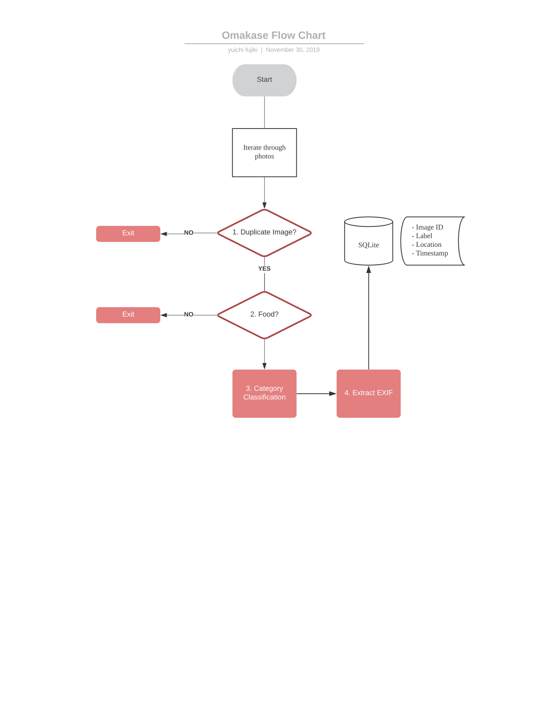
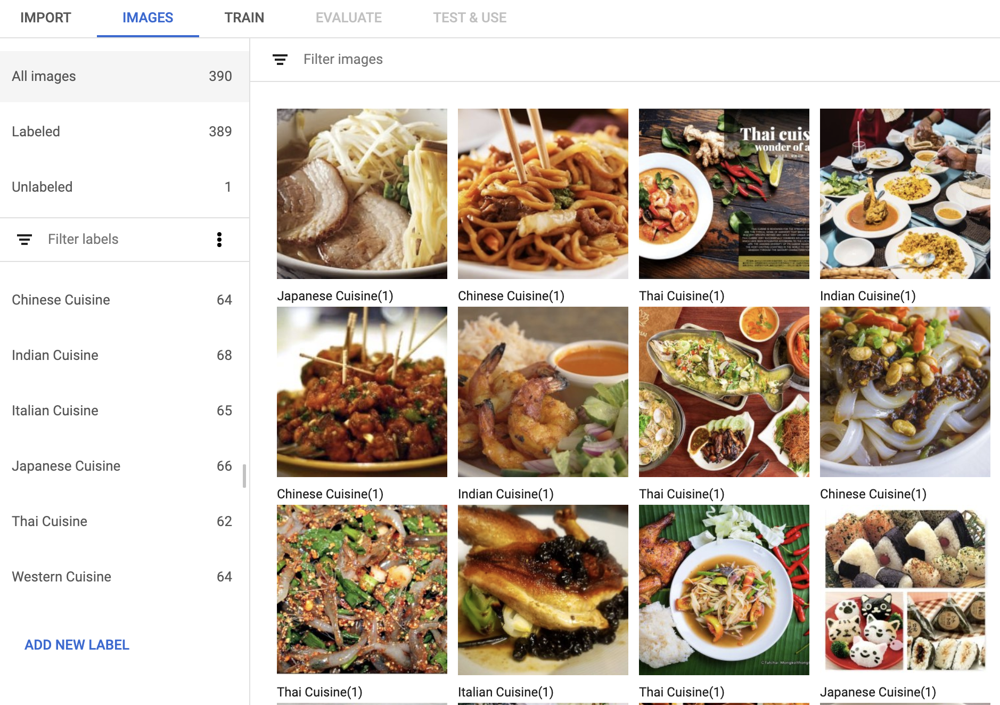

# Omakase
Omakase: Personalised recommendations using images in users' photo libraries

## Idea
Have you ever had a hard time to decide where to eat? Have you ever been at a loss what to make for dinner?

Omakase, the Android library we propose helps apps to make personalized recommendation using images in users' photo libraries. Omakase will include several food image classification models trained and deployed using AutoML Edge. It will also utilize timestamp and EXIF location information to weave time/space context into action.

Eating is a central pillar of human culture and there are myriads of apps that supports it. 
(Want to add several popular apps here. Ideas?) 
Our own ShopBack app allows users to receive cashback when they eat at our partner outlets with registered credit cards, and making timely recommendation about where to eat would be a very valuable feature. 

As far as our knowledge, there is no other app/SDK that utilizes photo library data to make such recommendation. Unlike other available information like social media data, the photo library data stays on the device, so only on-device processing makes logical sense. As a result, apps/users will benefit from the offline recommendation. We are confident that Omakase will allow many app developers to add an exciting feature and make their users lives significantly better.

## Plan 
**Disclaimer : The product in the repository is still in the planning stage.** In this section, we describe the big picture of our product.

### Interface

#### Initialise the SDK

Initialise from your project's application class `onCreate` method.

```
Omakase.getInstance().init(this);
```

After initialised, Omakase will create a background service that processes user's photo library.

#### Obtain recommendation 

The main interface for Omakase is the `recommend(...)` function. 

```
public interface OmakaseInterface {
    fun recommend(timeline: TimelinePreference?, placeKey: String?): Array<CuisineRecommendation>
}
```

You can call it as

```
val recommendations = Omakase.getInstance().recommend(timeline: .RECENT, placeKey: $GOOGLE_PLACE_API_KEY)
```

timeline param allows you to specify which photos in the timeline to prioritize. 

```
enum class TimelinePreference {
    NONE,        // Not prioritised according to timeline
    RECENT,      // Default. When RECENT is specified, recommend(...) function prioritizes recent data
    SEASONAL,    // When SEASONAL is specified, recommend(...) function prioritizes photos taken around same time period (~30 days) of the past years
    MONTHLY,     // When MONTHLY is specified, recommend(...) function prioritizes photos taken around same time period (~7 days) of the past months
    WEEKLY       // When WEEKLY is specified, recommend(...) function prioritizes photos taken on the same day in the past weeks
}
```

If you specify Google Places' API key, it also considers known restaurant location that matches with the photo's GPS information.

The recommendations are sorted via likelihood and come with raw scores.

```
final class CuisineRecommendation {
    private(set) var name: String
    private(set) var score: Double
}
```

### Flow

Here is the flow chart when we process photo gallery.



#### 1. Near Duplicate Image Detection

First, we will filter out photos that are similar to the photos we already processed. In the digital age, many users take same photos many times. It is not particularly likely for food photos, but it is possible for people to shoot in the burst mode. 

Using dHash + BKTree seems to be a promising solution.

https://benhoyt.com/writings/duplicate-image-detection/

#### 2. Detect food vs. no food

Here we use our first image classification model. This is a binary classifier model trained via AutoML. 
We expect that by separating this model out from category classification, we can improve accuracy of the category classification. 

We don't continue the process if the picture does not feature food.

#### 3. Category classification

Here we use our second image classification model. We will start with some of the popular dining categories in our app, like "Japanese", "Chinese", "Indian", "Thai", "Western", "Italian", as well as more specific food types like "Pizza", "Salads", "Ramen", "Steak", "Fried Chicken".



#### 4. Extract EXIF
We can obtain
- timestamp when photo was taken
- GPS information when photo was taken

from the photos in the photo library. (for most of the devices, at least)

#### 5. Storing the data in SQLite via Room

Each photo that was recognized as food, will be stored in the SQLite DB with 

- label
- timestamp (if available)
- location (if available)

These information will be used to make recommendation later when `OmakaseInterface.recommend(...)` is called.


